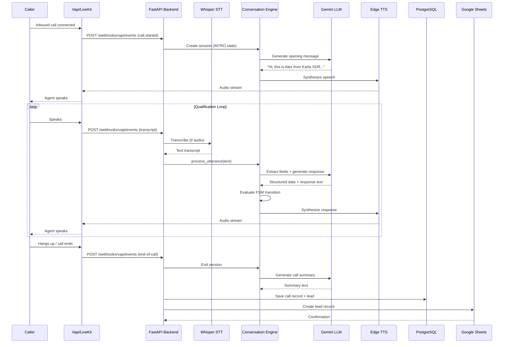
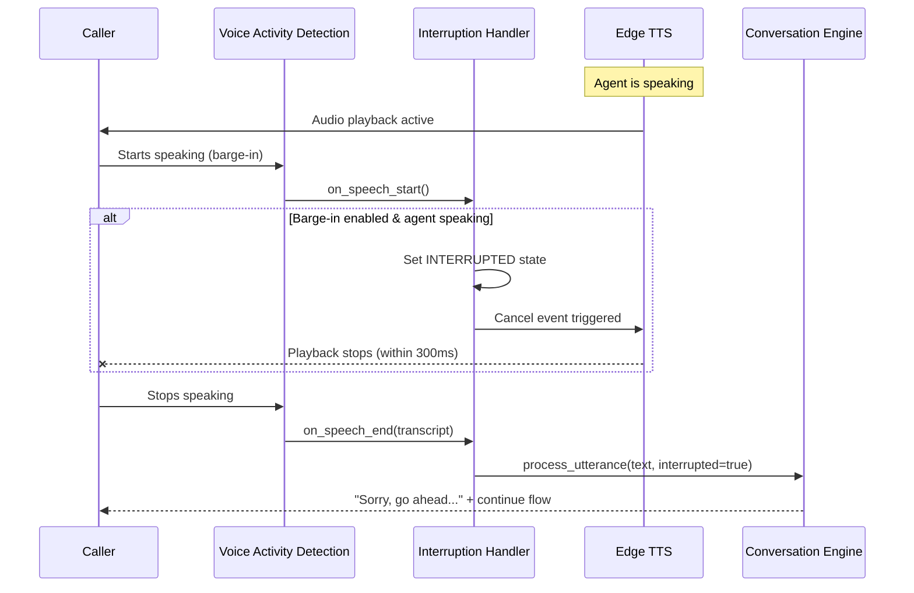
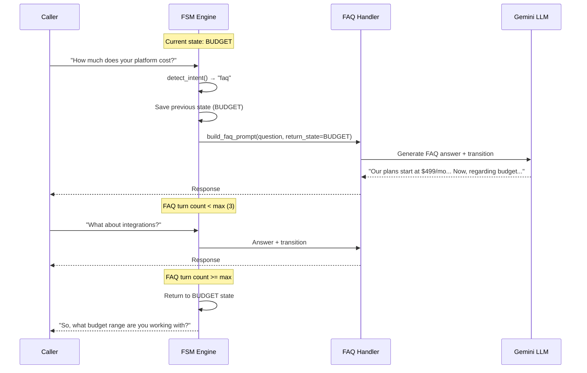
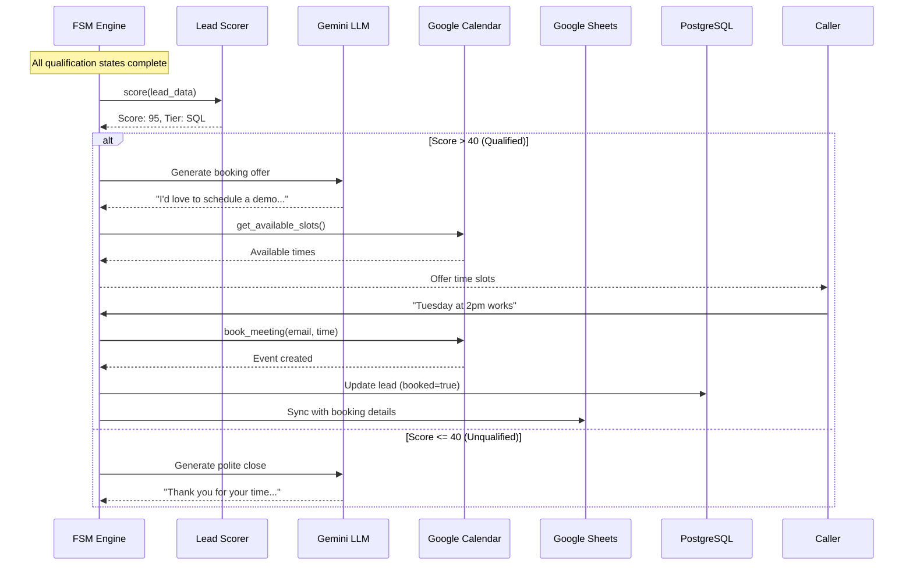
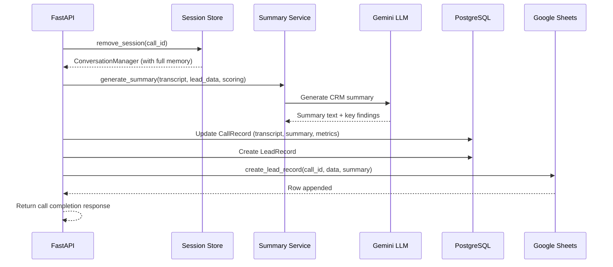
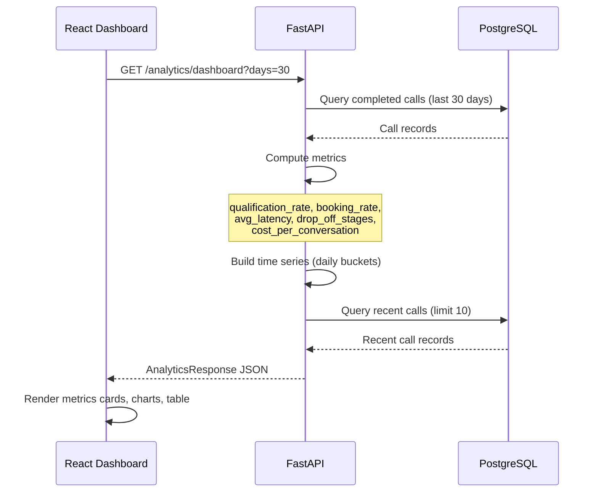

# Sequence Diagrams

## 1. Inbound Call Lifecycle

## 2. Barge-In / Interruption Handling

## 3. FAQ Detour and Return

## 4. Lead Scoring and Booking

## 5. Post-Call Processing

## 6. Analytics Dashboard Data Flow

